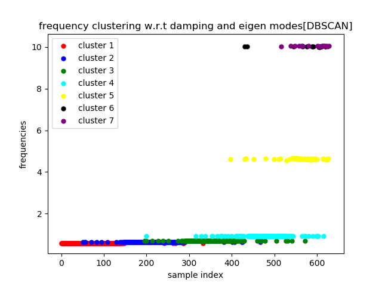

# clustering
EIGEN FREQUENCY CLUSTERING USING [KMEANS] [KMEANS &amp; PCA ] [DBSCAN] [HDBSCAN]

Kmeans has been used over the years as a clustering algorithm and quite reasonably performed very well. 
Its approval however is not due to any complex structure but a rather subtle appraoch towards data clustering using K-value(this value 
is the number of cluster using their mean. ) This mean value then serves as a refernce point for the clusters sorrounding it.

As simple and nicely as KMeans may try to solve our clustering problem. It would howvere fall short of clustering data
containing very noisy observation. This is therefore the disadvantage of Kmeans.

To solve this problem therefor..a team of researchers have introduced an approach which ignores the mean value for clustering but
even better this time considers their density...Hmmn! Reasonable right!. Indeed it is.

This algorithm is able to cluster data based on their density..According to their wiki

### A cluster then satisfies two properties:

#### All points within the cluster are mutually density-connected.
#### If a point is density-reachable from any point of the cluster, it is part of the cluster as well.

The same team of researchers further developed a more sophististated algorithm built on DBSCAN..HDBSCAN. 
However, the efficiency of this two algorithms is subject to the type of data you want.

For this sample.txt file in this folder, we found out DBSCAN is highly sufficient enough for us and does the clustering better

than its successor HDBSCAN.

## How to use script.

### Change the directory location of your data in the clusterscan.py
##### os.chdir(" change to your folder directory here")

### Preprocess be removing all unnneeded columns or simply by
### calling the needed column using pandas Dataframe(See online references for this...)

#### run the python script using X:>python clusterscan.py

#### Observe your output as they roll out one after the other...Close to see next image
